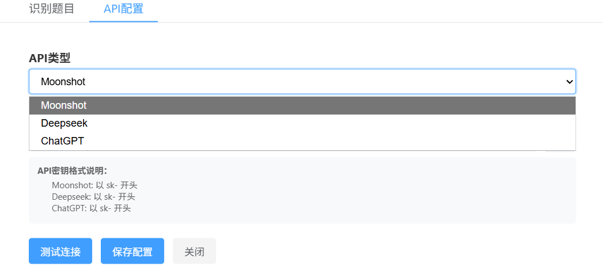
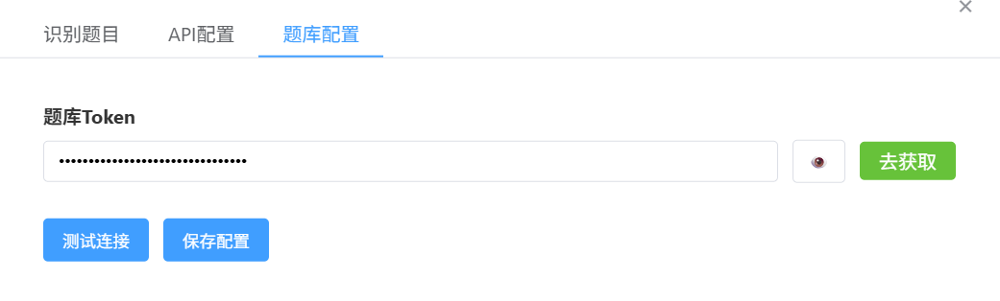

# OmniEdu自动答题助手

这是一个面向[omniedu(中软国际教育)](www.omniedu.com)的Tampermonkey脚本，通过DOM解析的方式识别题目，然后通过ai接口来作答，支持多个AI接口的调用，或者你也可以填入[言溪题库](https://tk.enncy.cn/)的token来进行题库辅助搜题

## 版本声明

- Node.js >= 20.0.0
- npm >= 9.0.0

## 安装

前往[Greasy Fork](https://greasyfork.org/zh-CN/scripts/542968-omniedu自动答题助手)快捷安装

## 开始使用

进入作答页面后会识别题目

### 配置apiKey

选择模型并填入密钥（Moonshot有15块钱免费额度，chatgpt未经测试）

申请密钥入口

1. [Moonshot AI - 开放平台](https://platform.moonshot.cn/docs/introduction#文本生成模型)
2. [DeepSeek - 开放平台](https://platform.deepseek.com/)

保存配置并测试连接，如果成功会弹出测试成功的提示

### 可选配置

购买言溪题库api次数之后，可以在这里填入token，实现**更高的正确率**

### 开始答题

点击开始答题后，会将题目一次性全部发给ai，所以较为缓慢，无需着急

## 免责声明

经过测试发现，ai答题正确率并不高，如果不接受，请不要使用

## 支持的AI模型

目前支持以下AI模型：

- DeepSeek
- Kimi
- chatgpt（未测试）

## 配置说明

1. 安装编译好的用户脚本到Tampermonkey
2. 在脚本设置面板中选择想要使用的模型并配置API密钥（点击保存配置后生效）

## 致谢

感谢[curly210102/create-tampermonkey: An easy way to start a Tampermonkey Userscript](https://github.com/curly210102/create-tampermonkey)提供的脚手架
