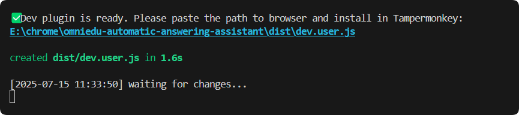
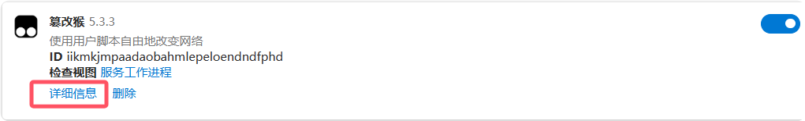
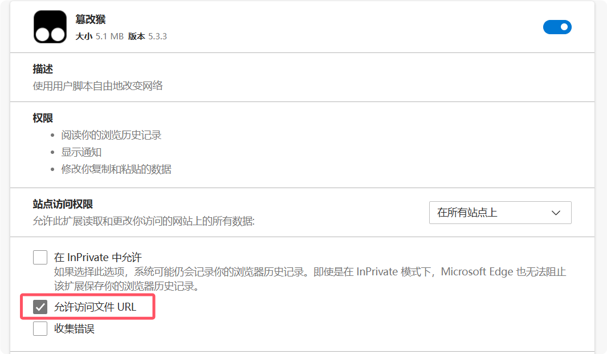
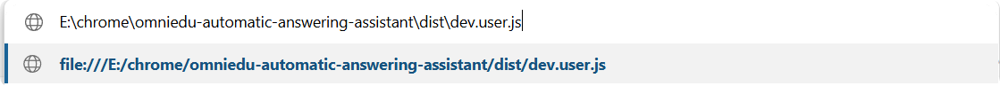
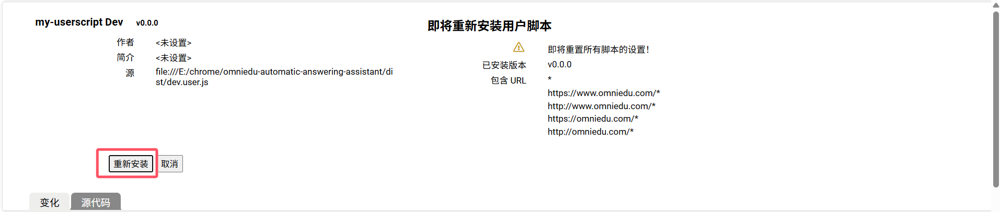
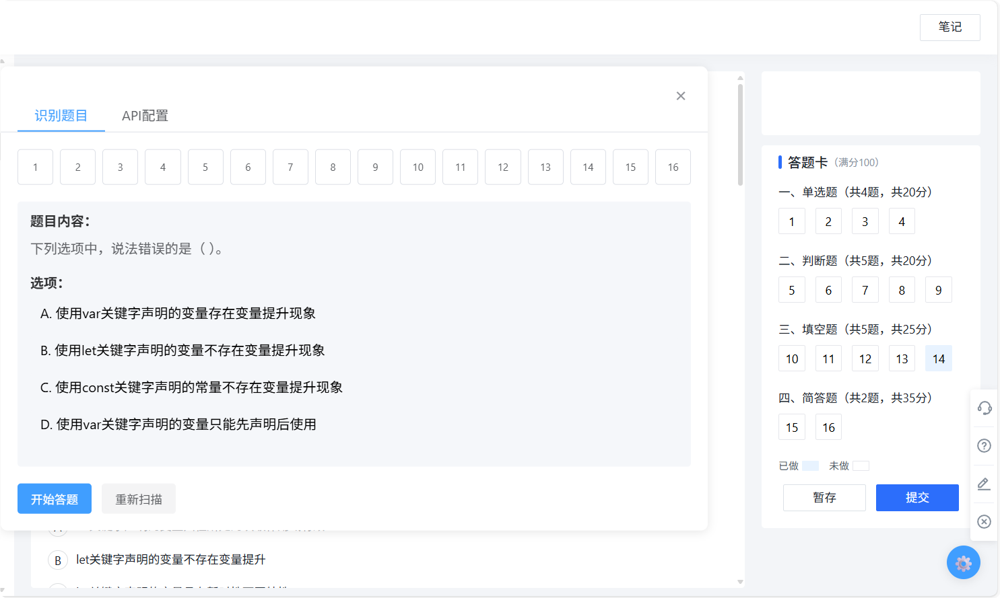
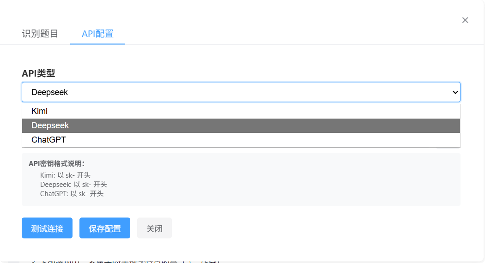
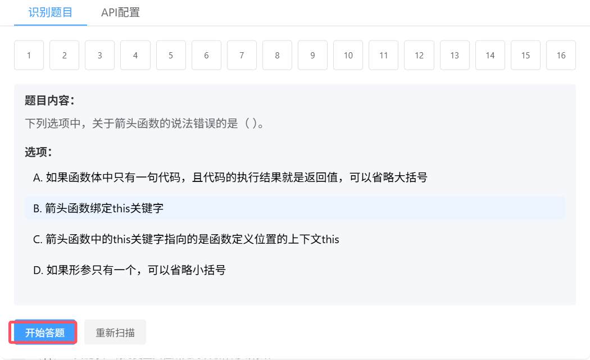

# OmniEdu自动答题助手

这是一个面向www.omniedu.com的，基于Tampermonkey的用户脚本，通过DOM解析的方式识别题目，然后通过ai接口来作答，支持多个AI模型（包括DeepSeek和Kimi）。


## 系统要求

- Node.js >= 20.0.0
- npm >= 9.0.0
- Tampermonkey浏览器插件


## 安装步骤

### 安装依赖：

```bash
npm install
```

### 编译

运行以下命令编译：

```bash
npm run dev
```

该命令会启动监听模式，当源文件发生变化时自动重新编译。编译后的文件将生成在`dist`目录下。

### 记住编译文件位置



### 配置油猴

进入浏览器插件管理页并点击油猴的详细信息



勾选**允许访问文件 URL**

在浏览器地址栏输入编译文件地址



安装或重新安装




### 开始使用

进入作答页面后会识别题目



选择模型并填入密钥（Moonshot有15块钱免费额度，chatgpt未经测试）

申请密钥入口

1. [Moonshot AI - 开放平台](https://platform.moonshot.cn/docs/introduction#文本生成模型)
2. [DeepSeekI - 开放平台](https://platform.deepseek.com/)



保存配置并测试连接，如果成功会弹出测试成功的提示


开始答题，点击开始答题后，会将题目一次性全部发给ai，所以较为缓慢，无需着急




## 免责声明

经过测试发现，ai答题正确率并不高，如果不接受，请不要使用


## 支持的AI模型

目前支持以下AI模型：

- DeepSeek
- Kimi
- chatgpt（TODO）


## 配置说明

1. 安装编译好的用户脚本到Tampermonkey
2. 在脚本设置面板中选择想要使用的模型并配置API密钥（点击保存配置后生效）
